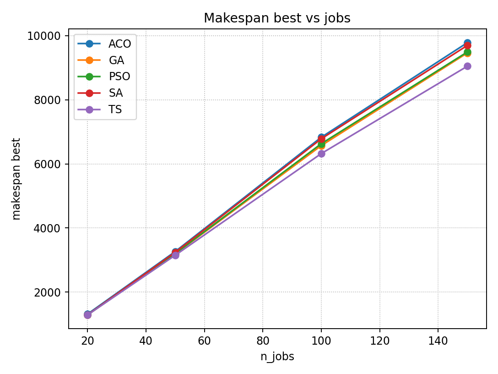
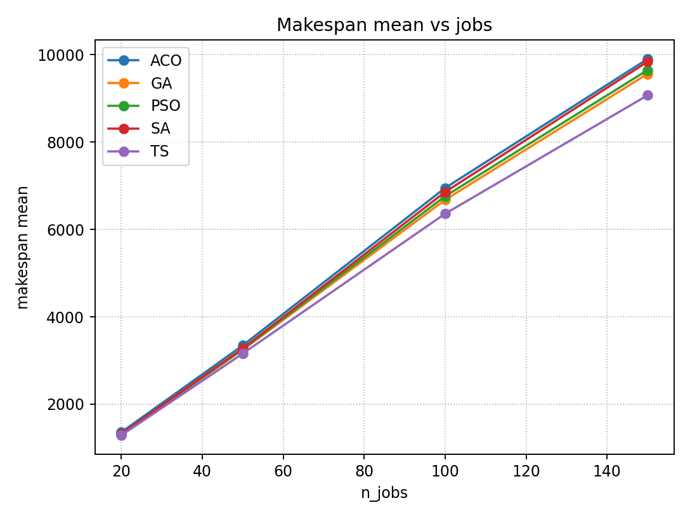
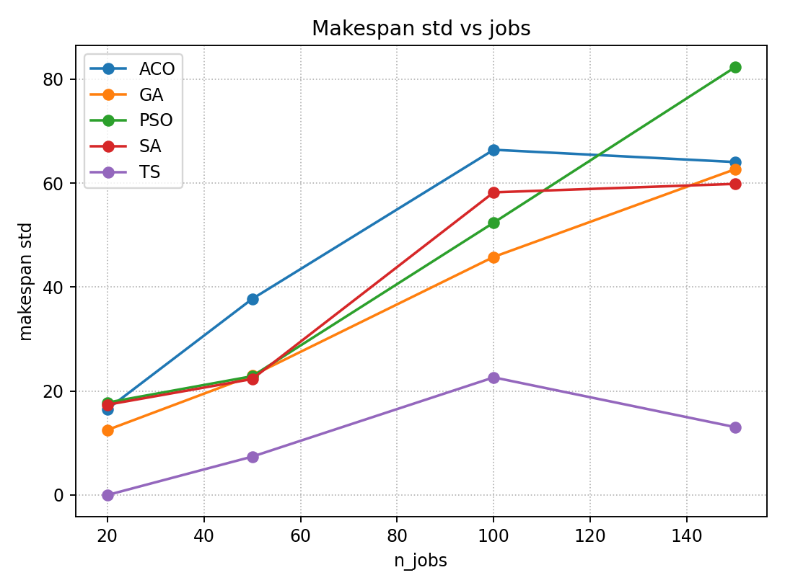
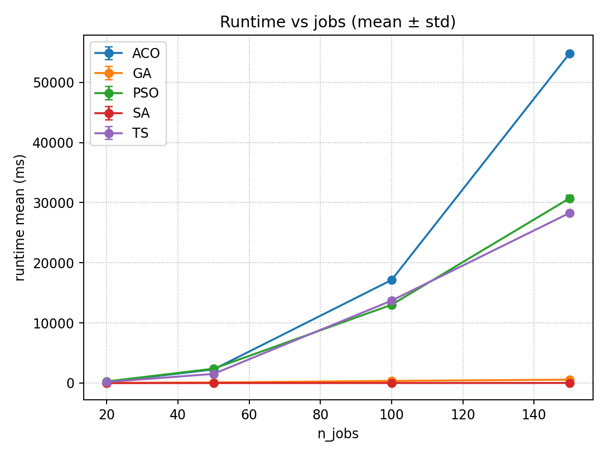

# Метагеуристические алгоритмы для задачи перестановочного flow-shop (PFSP)

## Аннотация

В данном проекте реализован и экспериментально исследован набор классических метаэвристических алгоритмов оптимизации, применённых к **перестановочной задаче flow-shop планирования (Permutation Flow-Shop Scheduling Problem, PFSP)**.  
Целью является минимизация **makespan** — времени завершения последней работы на последнем станке.

Проект ориентирован на **практическое сравнение** алгоритмов по качеству получаемых решений и вычислительным затратам при росте размерности задачи.

---

## Постановка задачи

Рассматривается стандартная задача PFSP:

- задано `n` работ и `m` станков;
- каждая работа должна последовательно обрабатываться на всех станках;
- времена обработки известны заранее и зависят от пары *(работа, станок)*;
- решение представляется в виде **перестановки работ**;
- критерий оптимальности — минимизация **makespan**.

Задача является **NP-трудной**, что делает применение точных методов непрактичным для средних и больших размеров задач, и мотивирует использование метаэвристик.

---

## Реализованные алгоритмы

В проекте реализованы следующие алгоритмы:

- **GA** — Генетический алгоритм  
  (перестановочное кодирование, турнирный отбор, OX-кроссовер, swap-мутация)

- **SA** — Имитация отжига  
  (окрестности swap / insert, критерий Метрополиса)

- **TS** — Табу-поиск  
  (динамический tabu-tenure, критерий аспирации, случайная выборка соседей)

- **ACO** — Муравьиный алгоритм  
  (феромонная матрица, эвристика на основе суммарных времен обработки)

- **PSO** — Рой частиц  
  (кодирование random-keys, ограничение скоростей и позиций)

---

## Методика экспериментов

Для каждого алгоритма проводилась серия запусков (`runs`) с различными начальными сидами генератора случайных чисел.  
Для каждой конфигурации фиксировались следующие метрики:

- **Best makespan** — лучшее найденное значение;
- **Mean makespan** — среднее значение по прогонам;
- **Std makespan** — стандартное отклонение;
- **Runtime mean / std** — среднее время выполнения и его разброс.

Результаты сохраняются в CSV и визуализируются отдельным скриптом.

---

## Визуализация результатов

Ниже приведены основные графики, полученные в ходе экспериментов.

### Лучшее значение целевой функции

Данный график отражает **предельную эффективность алгоритмов** и их способность находить качественные решения.

---

### Среднее значение makespan

Показывает **стабильность алгоритмов** и средний уровень качества решений при многократных запусках.

---

### Разброс значений makespan

Характеризует **устойчивость алгоритмов** и чувствительность к случайной инициализации.

---

### Время выполнения

Отражает **вычислительные затраты** алгоритмов и их масштабируемость при росте размерности задачи.

---